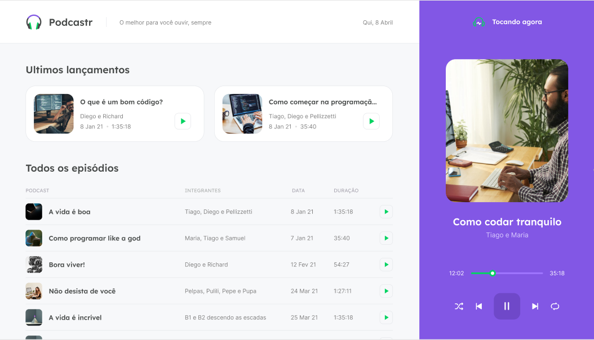

<h1 align="center">
    
    
</h1>

<p align="center">
  <a href="#sobre">Sobre</a>&nbsp;&nbsp;&nbsp;|&nbsp;&nbsp;&nbsp;
  <a href="#interface">Interface</a>&nbsp;&nbsp;&nbsp;|&nbsp;&nbsp;&nbsp;
  <a href="#tecnologias">Tecnologias</a>&nbsp;&nbsp;&nbsp;|&nbsp;&nbsp;&nbsp;
  <a href="#executar">Requisitos</a>&nbsp;&nbsp;&nbsp;|&nbsp;&nbsp;&nbsp;
  <a href="#licença">Licença</a>&nbsp;&nbsp;&nbsp;|&nbsp;&nbsp;&nbsp;

</p>

---

### 🔖 Sobre

<p align="justify">
  O <b>Podcastr</b> é uma plataforma voltada para o consumo de conteúdos em formato de Podcasts. Possui área de destaque, assim como listagem de episódios. Além disto, há uma página mais detalhada sobre cada episódio.

<p align="justify">
  Durante a NLW5 - Trilha React da <a href="https://www.rockeatseat.com.br" alt="Link do site da Rocketseat">Rocketseat</a> estudamos na prática o desenvolvimento de uma ferramenta com o uso do Next e os conceitos sobre SPA, SSR e SSG de maneira mais contextualizada. 
  
  A ferramenta foi desenvolvida em Next com Typescript e estilizada com SASS.  
  
    Principais aprendizados:
      - React: Componente, Estado e Propriedade.
      - Typescript: Conceito e tipagem.
      - Next: SPA, SSR, SSG, Roteamento, SEO. 
      - Recursos: Refs, ContextAPI, getStaticPaths e getStaticProps.
</p>

---

### 🖥️ Interface

<h2 align="center">
    
</h2>

###### Acesse aqui o link do  [Layout](https://www.figma.com/file/ryQA2oMZcWQxD71cIDoNn7/Podcastr-(Copy)). Ferramenta utilizada [Figma](https://www.figma.com/).

---
## 💻 Requisitos


- Você precisa instalar: [Node.js](https://nodejs.org/en/download/) & [Yarn](https://yarnpkg.com/) para rodar este projeto em seu computador.

###### Clone o projeto e acesse a pasta:

```bash
$ git clone https://github.com/itsmevictorhugo/podcastr.git
```
```bash
$ cd podcastr
```

**Siga as instruções abaixo:**

```bash
# Install the dependencies
$ yarn

# Run the backend fake server
$ yarn server

# Run the web server
$ yarn dev
```
---

### 🚀 Tecnologias

- [React](https://reactjs.org/)
- [Next](https://nextjs.org/)
- [SASS](https://sass-lang.com/)
- [Typescript](https://www.typescriptlang.org/)

---

### 📝 Licença

Esse projeto possui a licença MIT. Veja no arquivo [LICENSE](LICENSE) para mais informações.

---

**Feito com 💙 por [Victor Hugo](https://github.com/itsmevictorhugo).**
